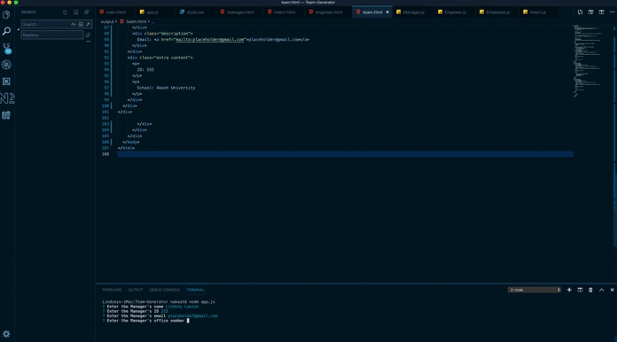
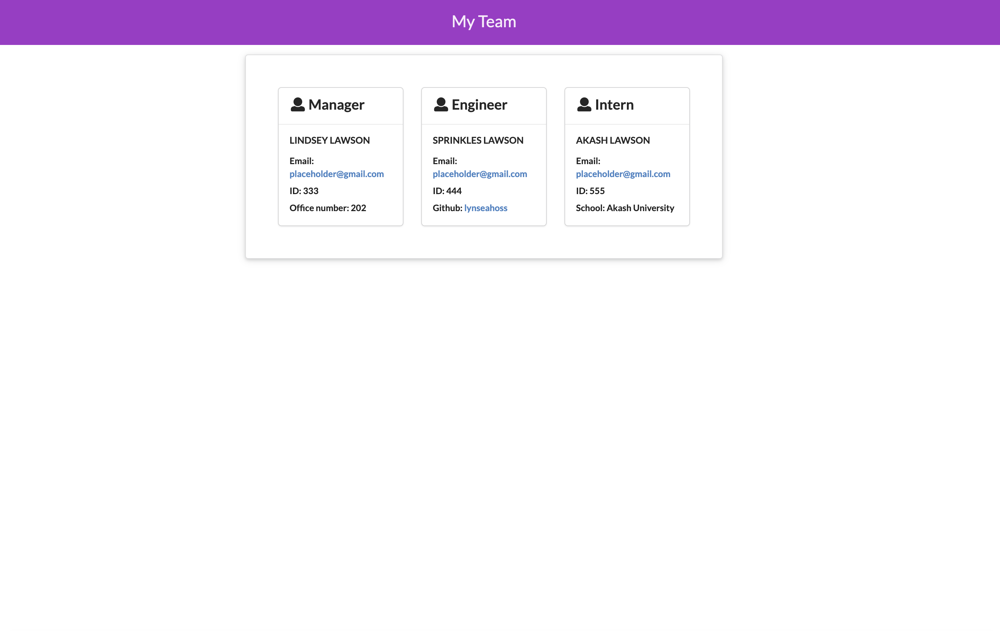

# Team-Generator

## Project Description

[Template Engine README](https://lynseahoss.github.io/Template-Engine/)
This project is a simple application that allows Employers to create a site to keep track of their current employees. The employer is prompted in Node to enter employee information which is then output into a team.html file. 

This is a responsive application that has foundation in HTML, CSS and Javascript. It utilizes a Semantic UI CSS framework. 
## Deployment

  

## Table of Contents

  * [User Story](#user-story)
  * [Acceptance Criteria](#acceptance-criteria)
  * [Project Technology](#project-technology)
  * [Screenshots of Application](#screenshots-of-application)
  * [Contributing Authors](#contributing-authors)

----

  ## User Story

    ```
    AS AN Employer of a company with 10 or more employees 
    I WANT to add and keep track of current employees
    SO THAT I can know who is currently employeed
    ```

  ## Acceptance Criteria

    ```
    GIVEN the user wants to enter a new employee
    WHEN the user types node app.js in terminal
    THEN Manager selection appears and prompts user to enter info about Manager
    WHEN the user is finished with manager user selects one of three list options Engineer, Intern, Exit List
    THEN user selects Engineer & is prompted to enter info about the Engineer
    WHEN the user is finished with Engineer user selects one of three list options Engineer, Intern, Exit List
    THEN user selects Intern & is prompted to enter info about the Intern
    WHEN the user is finished with Engineer user selects one of three list options Engineer, Intern, Exit List
    THEN user selects Exit List and the team.html is created
    WHEN the user opens team.html in browswer
    THEN new employee information is displayed
    ```

----

## Project Technology
<details>
    <summary markdown="span">Click to expand Project Technology Details</summary>

Languages
- HTML
- CSS
- Javascript


CSS Framework
- [Semantic UI](semantic-ui.com)


</details>


## Screenshots of Application




*Screenshot of My Team Page*


## Contributing Author

[Lindsey Lawson](https://github.com/lynseahoss)


